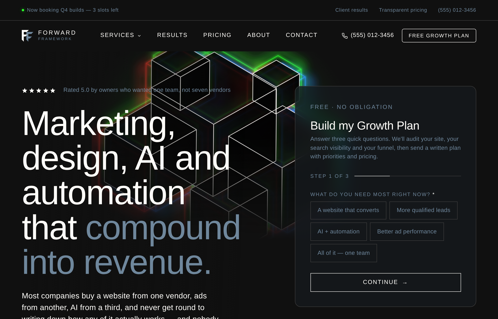
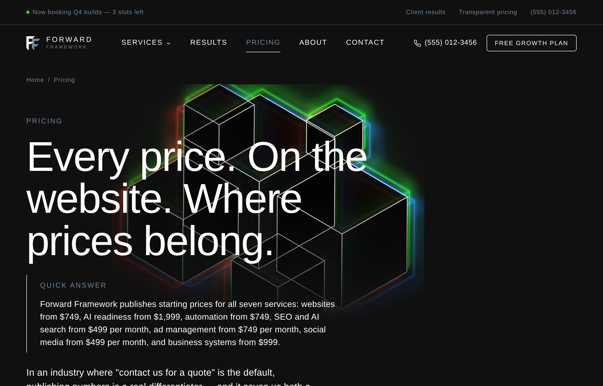

<div align="center">


### Web design, AI consulting, automation and marketing — built as one growth engine

[](https://github.com/ForwardFramework/Webdesign/actions/workflows/pages.yml)
[](#)
[](#)

**[Live site](https://forwardframework.github.io/Webdesign/)** · **[Deploy guide](DEPLOY.md)** · **[How it was built](#how-it-was-built)**

<sub>The live link goes live once Pages is enabled — see the note below.</sub>

</div>

---

<div align="center">
  
  
</div>

---

## What this is

A 17-page marketing website for Forward Framework — a US agency offering web design, AI
consulting, automation, marketing, ad management, social media and business systems.

It is static HTML, CSS and vanilla JavaScript. **No framework, no build step, no dependencies.**
Every page works with JavaScript disabled. The whole site is 147 KB zipped.

| | |
|---|---|
| **Pages** | 17 — homepage, 7 service pages, pricing, results, about, contact, legal, 404 |
| **Weight** | 40 KB CSS · 16 KB JS · no external libraries |
| **Fonts** | Jost + Inter, loaded async from Google Fonts with a real fallback stack |
| **Accessibility** | WCAG AA contrast across the palette, keyboard navigable, `prefers-reduced-motion` honoured |
| **Structured data** | Organization, Service, OfferCatalog, FAQPage, HowTo, BreadcrumbList |

## Quick start

```bash
python3 -m http.server 8000     # then open http://localhost:8000
```

That is the entire toolchain. To regenerate the pages after editing content:

```bash
python3 tools/build.py
```

## Deploying

Full walkthroughs for each host are in **[DEPLOY.md](DEPLOY.md)**.

> [!IMPORTANT]
> **Netlify is the live host.** Every push to the working branch builds and
> deploys automatically via `.github/workflows/netlify.yml`. The other hosts are
> kept as alternatives and their workflows are manual-only.

| Host | Status | Notes |
|---|---|---|
| **Netlify** | **live — deploys on push** | `tools/build_netlify.py` — clean URLs, `_redirects`, `netlify.toml` |
| Cloudflare Pages | alternative, manual | `tools/build_cloudflare.py` — clean URLs, `_headers` |
| Vercel | alternative | `vercel.json` included |
| GitHub Pages | alternative, manual | `tools/build_pages.py` — rewrites paths for the subpath |
| Anything else | `python3 tools/build_zip.py --portable` | Plain static files |

> [!NOTE]
> **GitHub Pages, if you ever enable it, needs one manual step.**
> Go to **Settings → Pages → Build and deployment → Source: `GitHub Actions`**, then re-run the
> workflow. This cannot be automated — creating a Pages site requires admin rights the workflow
> token does not carry, so every run fails at *Configure Pages* until it is set.
> Once live, the site publishes to `https://forwardframework.github.io/Webdesign/`.

> [!NOTE]
> This repository has no `main` branch. The workflow runs from
> `claude/forward-framework-website-qwe3cg`.

## Project structure

```
index.html              Homepage — also the source of truth for the site shell
services/               Hub + 7 service pages
pricing.html            Every published price
results.html            Case studies
about.html              Method and operating principles
contact.html            Growth Plan form
privacy.html terms.html thank-you.html 404.html
assets/css/styles.css   The complete design system, one file
assets/js/main.js       Nav, multi-step forms, validation, ROI calculator
robots.txt sitemap.xml llms.txt site.webmanifest
tools/                  Build scripts (see below)
```

`index.html` is hand-authored and holds the site shell. `tools/build.py` extracts that shell and
stamps it onto every other page, so navigation and footer can never drift.

<details>
<summary><b>The build scripts</b></summary>

| Script | What it does |
|---|---|
| `tools/build.py` | Regenerates all pages plus `robots.txt`, `sitemap.xml`, `llms.txt` |
| `tools/build_zip.py` | Upload-ready zip. `--portable` drops host-specific config |
| `tools/build_pages.py` | Stages `_site/` for GitHub Pages, rewriting paths for the subpath |
| `tools/build_preview.py` | Single self-contained HTML file containing all 17 pages |
| `tools/build_source_pdf.py` | The whole source as a printable document plus a text bundle |
| `tools/set_domain.py` | Rewrites the absolute domain everywhere, then rebuilds |

</details>

---

## How it was built

<details>
<summary><b>The five agency sites reverse-engineered</b></summary>

<br>

Chosen for organic traffic scale combined with documented conversion performance in the US market.

| Site | Why | What was taken |
|---|---|---|
| **WebFX** | Among the highest-traffic agency domains in the US | Hard-number proof band, transparent pricing tables, one dominant "free proposal" offer |
| **KlientBoost** | Proposal requests are their primary acquisition metric | A *free plan* instead of a free consultation; click-triggers under every CTA |
| **SmartSites** | 360+ verified reviews, consistently top-ranked on Clutch | Lead form inside the hero, phone in the global header, badge wall under the form |
| **NP Digital** | Authority model built on a huge content and free-tool footprint | Free interactive tool as top-of-funnel, question-shaped content architecture |
| **Hook Agency** | Radical pricing transparency in an industry that hides it | Published prices, layered conversion paths, a tagline naming exactly who it is for |

**Findings applied**

- Interactive lead magnets convert roughly **2.4×** static PDF downloads
- Burying social proof below the fold measurably weakens performance
- A single dominant CTA beats competing CTAs
- Section order matching how a skeptical buyer evaluates: hero → proof → problem → solution → evidence → close

</details>

<details>
<summary><b>The offer behind each service</b></summary>

<br>

Every service leads with a real deliverable rather than a "book a call" button.

| Service | Free offer | Why it converts |
|---|---|---|
| Web Design | Homepage concept, actually designed | Shows the work instead of describing it |
| AI Consulting | AI Opportunity Audit | A small diagnostic anchors and de-risks a large build |
| Automation | Automation blueprint | Sells an absence — the number has to be produced before it is believed |
| Marketing / SEO | AI Search Visibility Report | Shows a transcript of an AI recommending their competitors |
| Ad Management | Ad account audit | Most audited accounts hide 20–40% wasted spend |
| Social Media | 30-day content plan, 10 scripted posts | Immediately usable, which is why it earns the reply |
| Scaffold | Key-Person Risk Map | Names processes living in one person's head, ranked by revenue at risk |

</details>

<details>
<summary><b>Design system</b></summary>

<br>

The brand mark supplied the entire system: black field, white primary, warm taupe secondary,
45° chamfers, wide-letterspaced geometric caps.

```
--ink   #0A0A0A   page field        --white      #FFFFFF   primary
--bone  #EFEBE6   light sections    --taupe      #A99A8C   secondary / CTA
--text  #C9C6C1   body              --taupe-lt   #C9BCAF   hover / emphasis
--muted #8B8681   secondary text    --taupe-ink  #6B5E52   taupe on light
```

- **Display:** Jost — a geometric face matching the logo's wordmark · **Body:** Inter
- **Chamfer motif:** `clip-path` cuts the bottom-right corner of buttons, cards and panels,
  echoing the 45° cuts in the FF monogram
- Swiss/minimalist grid, 1px rules, generous whitespace, one soft radial in the hero

</details>

<details>
<summary><b>SEO, GEO and AEO</b></summary>

<br>

**Traditional SEO** — semantic HTML5, one `<h1>` per page, canonicals, Open Graph and Twitter
cards, `sitemap.xml`, breadcrumbs, no render-blocking JavaScript, CLS-safe layout.

**AEO** — a direct 40–60 word answer opens every key section, H2s written as the questions buyers
actually ask, `FAQPage` schema **word-for-word identical** to the visible copy (verified by the
build check), and a `speakable` specification.

**GEO** — a full JSON-LD `@graph` with `sameAs` entity links, an `llms.txt` index at the root, and
a `robots.txt` that explicitly allows GPTBot, OAI-SearchBot, ClaudeBot, PerplexityBot,
Google-Extended, Applebot-Extended, CCBot and others.

> `AggregateRating` and `Review` schema are **deliberately omitted**. Publishing invented ratings
> risks a Google manual action. Add them once real reviews exist.

</details>

<details>
<summary><b>Accessibility</b></summary>

<br>

- Every text pair in the palette meets **WCAG AA (4.5:1)** — audited programmatically, three
  failures found and fixed
- Focusable `role="alert"` error summary linking to each invalid field, `aria-describedby`,
  `aria-invalid`, validation on blur
- Skip link, visible focus rings, `aria-expanded` on disclosures, 44px touch targets
- `prefers-reduced-motion` honoured; scroll reveals are progressive enhancement, so all content
  renders without JavaScript — which also matters for AI crawlers that do not execute it

</details>

---

## Before launch

Everything below is a placeholder and is marked in the source.

| What | Current value |
|---|---|
| **Phone** | `(555) 012-3456` — reserved fictional range |
| **Email** | `hello@forward-framework.com` |
| **Domain** | `https://www.forward-framework.com` — change with `tools/set_domain.py` |
| **Form endpoint** | `REPLACE_WITH_YOUR_FORM_ENDPOINT` on every `data-endpoint` |
| **Case studies** | Illustrative examples, marked `PLACEHOLDER` in HTML comments |
| **Testimonials** | Illustrative, marked `PLACEHOLDER` |
| **Partner badges** | Text placeholders in the trust bar |
| **Postal address** | Intentionally absent from schema — add once HQ is confirmed |
| **Legal pages** | Templates — have counsel review |

Then verify in Google Rich Results Test, submit the sitemap in Search Console, and add analytics
(the form handler already pushes a `generate_lead` event to `dataLayer` when GTM is present).
